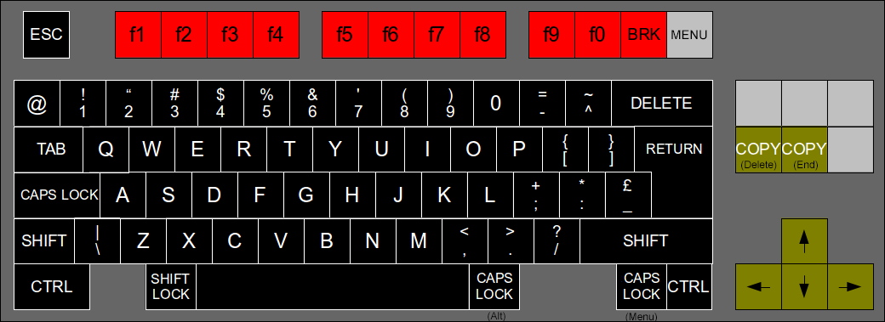

# BeebFpga_MiSTer

An experiment in building a BBC Micro MiSTer core by using the [official core](https://github.com/MiSTer-devel/BBCMicro_MiSTer) harness with the updates in the [BeebFPGA](https://github.com/hoglet67/BeebFpga) emulation. The BeebFPGA is actively maintained and incorporates a range of improvements to the emulation over the official MiSTer Core.

This core supports the original features of the MiSTer core:
- BBC Model B and Master 128 emulation
- Correct CPU for each model for best compatibility: 6502 for BBC Model B, 65C02 for Master 128
- Optional co-processor module with 65C02
- Support Secondary SD card as well as images on Primary SD card
- Scandoubler with HQ2x for all modes
- Support for analogue joysticks
- Emulation of joystick with mouse
- Support for RTC module to drive RTC on Master 128

This core also supports the following additional features:
- MMFSv2 allowing SSD files stored on the secondary SD card to be accessed directly.
- DFS support to access SSD files on both the BBC B and the Master 128
- Rounded characters in Mode 7
- Music 5000 sound add-on
- Improved compatibility with various software
- Enhanced keyboard mapping

## Installing and Using

### Main Version

Most users will just want the main version described here.

Copy the file `releases/BBCMicro_YYYYMMDD.rbf` to the `Computer` or `Computer/_Alternative` folder on the root of the MiSTer primary SD card. You can then select the file from the MiSTer boot menu or set to autoboot by editing the `bootcore` in `MiSTer.ini`.

### ICE (In Circuit Emulator) Version

The ICE (In Circuit Emulator) Version contains special functions to enable debugging of system operation at the level of 6502 instructions. This is intended for advanced users who need a machine code level monitor/debugger. Most users can skip this section.

The ICE Version includes the [AtomBusMon](https://github.com/hoglet67/AtomBusMon) debugger for the main CPU on the BBC B and Master 128. Due to memory limitations the ICE Version does not support sideways RAM in ROM slots 4-7, the co-processor, or the Music 5000.

Copy the file `releases/BBCMicro_ICE_YYYYMMDD.rbf` to the `Computer` or `Computer/_Alternative` folder on the root of the MiSTer primary SD card. 

The AtomBusMon interface is connected to an internal UART that is accessible via the Hard Processor System (HPS) on the DE-10 Nano. To access this from a host computer perform the following steps:
- Connect a computer to the `UART` USB port on the DE-10 Nano.
- On the computer open a serial terminal to the DE-10 Nano at 115200 baud.
- Logon to the MiSTer Linux command line on the DE-10 Nano using the user ID `root` and password `1`. You may need to send a `return` character to get a logon prompt.
- From the Linux command line connect to via the internal UART to the ICE. This can be done with the command `picocom -b115200 --omap delbs /dev/ttyS1` (i.e. connect to serial device `/dev/ttyS1` at 115200 BAUD with the Delete key mapped to backspace).
- For how to use the ICE refer to the [AtomBusMon Wiki](https://github.com/hoglet67/AtomBusMon/wiki).
- Note that you may get some logging messages from Linux mixed in with the AtomBusMon output!
- To quit picocom use `Ctrl-A Ctrl-X`.

Note that AtomBusMon is loaded with the 65C02 software branch. This can be used on both the BBC B 6502 and the Master 128 62C02, but it won't correctly disassemble "illegal" 6502 opcodes.


## Filing Systems

There are several filing systems supported, and this may seem confusing. As different options support different requirements it seems best to provide the flexibility. One complicating factor is that MiSTer can support two SD cards that are accessed via different means. The primary SD card (on the DE10 Nano) is accessed via the Hard Processor System and presents an API interface to the MiSTer core. The secondary SD card (on the MiSTer expansion) is directly connected to the MiSTer core.

If I doubt I would start with MMFS v1.

### MMFS v1

The default filing system is [MMFS v1](https://github.com/hoglet67/MMFS). 

MMFSv1 uses files in “MMB” format. This was a format originally developed for a BBC Micro add-on that connects SD cards to the user port and makes it look like a virtual set of disk-drives. The MMB file is a bundle of hundreds of BBC floppy disk images. Using commands on the BBC Micro you can choose to mount the images from the file into virtual drives.

The BBC core offers two ways to mount the MMB file. If you have a secondary SD card then format as FAT32 or FAT16. Copy the MMB file as “BEEB.MMB” on to the card. The core will automatically pick up that card. In this mode the file can be both read and written.

The alternative copy the MMB file to the “games/BBC Micro” directory on the main SD Card. If it is renamed “boot.vhd” then it will be automatically loaded. If not then you can manually load it from the MiSTer menu. In this mode the file is **read only**. To unmount a previously mounted MMB/VHD (e.g. to go back to the secondary card) press backspace when picking the file.

```
Some useful MMFS Commands:
 *DCAT [start #] [end #]   - List disks in the MMB file
 *DIN [Drive #] <Disk #>   - Mount disk in the specified drive (default 0)
 ```

For a handy MMB file with a good selection of BBC games try the "BEEB.MMB File v1.02" available [from RetroClinic](http://www.retroclinic.com/docs/index.htm).


### MMFS v2

An alternative filing system of [MMFS v2](https://github.com/hoglet67/MMFS) may be selected from the MiSTer menu. In MMFSv2 you can access SSD disk files on a FAT 32 formatted SD card in the secondary slot. Alternatively, you can pick an a file which is disk image (IMG) on the primary SD card and read SSD files from that.

### Acorn DFS

The classic Acorn DFS can be selected and is supported via emulation of the FD1770 controller. In DFS mode you can mount individual SSD and DSD files from the primary SD Card.

### MMFS and DFS

Both MMFS and DFS may be activated at once. However, I am told by the author of MMFS: "It's generally not recommended to have both MMFS and DFS fitted and active at the same time, as they both use they the file system number, so things get very confusing. This is done to maximise compatibility with games that check specifically that DFS is the current file system by testing the file system number."

If you have both active then note that MMFS will treat `*DISC` and `*DISK` commands as belonging to it. You can used `*OPT 5,1` to disable this and have DFS respond to these commands.

## Hardware

The simulated machines are pretty close to the standard configurations.

The BBC B has an FC1770 Floppy Disk Controller fitted. The mouse is connected to a VIA at the normal User VIA address. There is an extra VIA at the &FEA0 (normally Econet) that is connected to the secondary SD card.

The Master 128 also has a mouse is connected to a VIA at the normal User VIA address. The SD card is connected to the VIA at &FE80.

## ROMS

In both machines, ROM slots 4-7 contain RAM which can be loaded with additional ROMs.

### BBC B ROMS

The following ROMs are fitted:
```
Slot  3 - DFS (If active)
Slot  8 - MMFS (If active)
Slot 15 - RAM Master v6
Slot 16 - Basic
```

I've got mixed feelings about RAM Master. I can't find any documentation or source for it. It's a bit intrusive, but also useful so I've kept it in. There is enough information in `*HELP RAM` to workout most of the commands.

### Master 128 ROMS

The following ROMS are fitted:
```
Slot  3 - MMFS (If active)
Slot  9 - DFS (If active)
Slot 10 - View Sheet
Slot 11 - Edit
Slot 12 - Basic
Slot 13 - ADFS (Not supported)
Slot 14 - View
Slot 15 - Terminal 
```

## Keyboard Mapping

The keyboard mapping attempts to follow the physical layout of the BBC Micro as much as possible when mapped onto modern keyboards. The diagram below shows the BBC keys on a standard UK layout PC keyboard.

There may be more "Caps Lock" keys than you expect! This is to give some reasonable options for games that use Caps Lock and Control as left and right.

Note that Break is F11. Unlike the official MiSTer implementation you don't need to use Control to get the Break.



## Music 5000

The Music 5000 is an add-on for the BBC Micro supporting wave-table synthesis. At the time it was fairly rare though it had a cult following. It was an external box that connected to the BBC over the "1MHz Bus" port. Retrospectively it's had a second life though emulation and modern reconstruction of the hardware.

This emulation includes the Music 5000 hardware. To you use it you will need a ROM and suitable boot disk. (The original ROMs had a copy protection system that also needs to be patched out in the emulation).

I used the "Music 5000 System Disk" from [Colin Fraser's site](http://www.colinfraser.com/m5000/m5000.htm). His page contains instructions to use on a Master 128 (you may need to use `*OPT 4,3` to enable the shift-boot. If you are using via MMFS you will need to manually reselect the disk and reset again once the ROMs are loaded). 

To use on a BBC Micro you need to:
- Load the "Ample" ROM `R.AMPLE` into a sideways ROM slot
- Load the Ample Help File ROM `ANHF` into a sideways ROM slot
- Start the "Runner" file: `*EXEC runner`
- This should start the AMPLE environment. From the menu you can load an example, e.g. `concert`

There is also a lot of Music 5000 information and software on the [Retro-Kit](https://www.retro-kit.co.uk/Hybrid-Music-System/) site.

Aside: Back in the day I did have a Music 500 (essentially the same hardware as Music 5000). I could never get anything out of it that I thought sounded good and rapidly gave up trying. I am afraid all the demos I've heard now for Music 5000 don't improve my assessment! It always struck me as odd that what was at the time a pretty advanced system was still so "bleepy". Still, it has its fans and I am glad it's been rediscovered.


## Known Bugs and Limitations

- You must manually apply reset using the menu if you change the hardware configuration
- Only HDMI output has been tested. VGA may not be good (or working at all!)
- Sound mixing between the Music 5000 output and the BBC sound isn't good. Don't play both at once.
- The "VideoNuLA" (a modern upgrade to the original VideoULA) is not supported.
- Selecting Drives 2 and 3 in DFS creates some odd results.


## Some Development Notes

Thanks to the excellent work already done by several people, and with the particular help of David Banks/[hoglet67](https://github.com/hoglet67), there weren't a lot of massive issues bringing this together.

The biggest problem was porting the FC1770 Floppy Disk Controller to the BBC B. [This site](http://www.adsb.co.uk/bbc/disk_controllers/) highlighted the important but obscure fact that the FC1770 is mapped to different addresses on the BBC B and the Master. What it doesn't mention is that also the bits in the "control register" are assigned to different values on the BBC B and Master. That took some finding.

There is also a check for the presence of the FC1770 in the Acorn BBC B DFS ROM that seems to rely on reset behaviour of the chip that wasn't quite working in the original simulation. (It writes to the TRACK register and then reads back - I believe while the reset line is held low). That required some effort to find.

There are some notes in the code on how to move between the normal version and the ICE version in the code. Note it requires modifying parameter in two files: BBCMicro.sv and bbc_micro_core.vhd.

